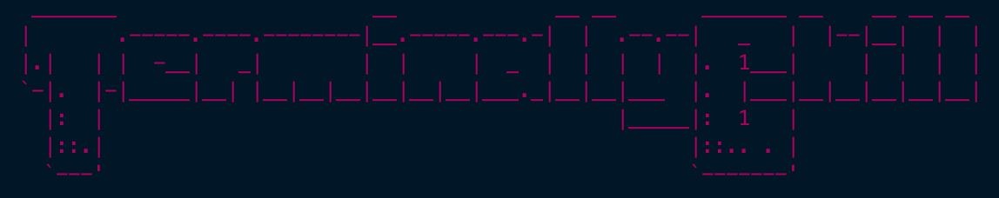
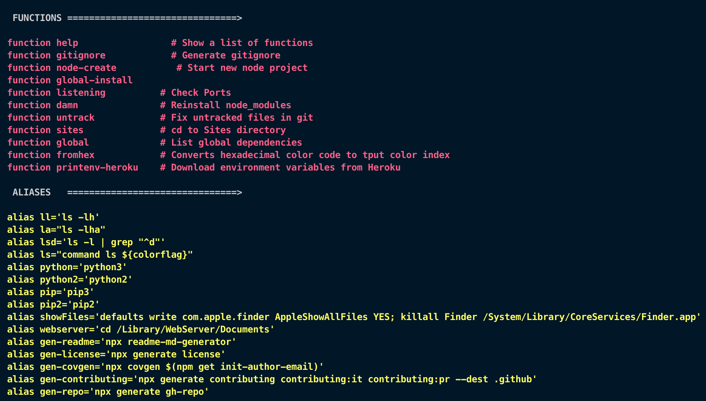

# Welcome to the TerminallyChill Bash Setup 👋


[](https://twitter.com/CapnAwesome)




> Custom bash_profile and shell functions

### 🏠 [Homepage](https://pterobyte.github.io/bash)

## Install

```sh
sh install.sh
```

## Author

👤 **JT Houk**

* Twitter: [@CapnAwesome](https://twitter.com/CapnAwesome)
* Github: [@Pterobyte](https://github.com/Pterobyte)

## 🤝 Contributing

Contributions, issues and feature requests are welcome!

Feel free to check [issues page](https://github.com/Pterobyte/bash/issues).

## Show your support

Give a ⭐️ if this project helped you!

<a href="https://www.patreon.com/TerminallyChillSoftware" rel="nofollow">
  
</a>
