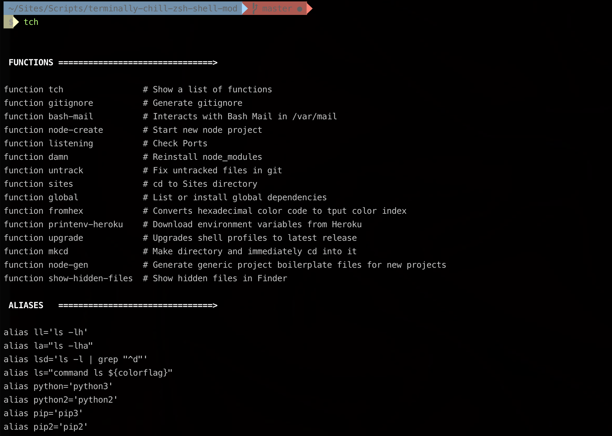

[![Contributors][contributors-shield]][contributors-url]
[![HitCount][hitcount-shield]][hitcount-url]
[![License: MIT][license-shield]][license-url]
[![LinkedIn][linkedin-shield]][linkedin-url]
[![Twitter: HoukasaurusRex][twitter-shield]][twitter-url]

<br />
<p align="center">
  <a href="https://github.com/HoukasaurusRex/jt.houk.space">
    
  </a>

  <h1 align="center">Terminally Chill ZSH Config</h3>

  <p align="center">
    An extensible and versatile terminal config for <a href="https://en.wikipedia.org/wiki/Z_shell">ZSH</a>
    <br />
    <a href="http://zsh.sourceforge.net/Doc/Release/zsh_toc.html"><strong>Explore the docs »</strong></a>
    <br />
    <br />
    <a href="https://github.com/HoukasaurusRex/terminally-chill-zsh-shell-mod/issues">Report Bug</a>
    ·
    <a href="https://github.com/HoukasaurusRex/terminally-chill-zsh-shell-mod/issues">Request Feature</a>
  </p>
</p>

## About the Project

[![][product-screenshot]][product-url]

If you spend a lot of time in your terminal trying to get the most out of your shell config, this project can help speed up your workflow. It's built especially for node.js developers, but can be easily configured to benefit any language or framework workflow.

### Built With

* [ZSH](http://zsh.sourceforge.net/Doc/)

## ☕️ Getting Started

To get it running locally, install dependencies with yarn and run the commands

### Prerequisites

* node.js/npm (recommended to install via [nvm](https://github.com/nvm-sh/nvm))
* unix-based system (tested on Mac/Linux)

### Installation

```sh
make install
```

## 🔧 Usage

Print a list of aliases and functions by running `tch`



Extend your PATH, exports, functions, aliases, etc. by modifying the corresponding files in [/lib](lib)

_For information on ZSH, refer to the [Documentation](http://zsh.sourceforge.net/Doc/Release/zsh_toc.html)_

## 🗺 Roadmap

See the [open issues][issues-url] for a list of proposed features (and known issues)

## 🛠 Contributing

Want to make a change? Any contributions you make are **greatly appreciated**.

Check out the [issues page][issues-url]

1. Clone the repo
2. Create your Feature Branch (`gco -b release/my-project`)
3. Commit your Changes (`git commit -m add: small addition`)
4. Push to the Branch (`git push origin release/my-project`)
5. Open a Pull Request

## ✏️ Contact

* JT Houk - [@HoukasaurusRex](https://twitter.com/HoukasaurusRex)

[logo]: https://res.cloudinary.com/jthouk/image/upload/e_improve,w_40,h_40/v1582802259/Profiles/jt-2d.png
[url]: https://terminally-chill-zsh-shell-mod
[github-url]: https://github.com/HoukasaurusRex
[contributors-shield]: https://img.shields.io/github/contributors/HoukasaurusRex/terminally-chill-zsh-shell-mod.svg?style=flat-square
[contributors-url]: https://github.com/HoukasaurusRex/terminally-chill-zsh-shell-mod/graphs/contributors
[hitcount-shield]: https://hits.dwyl.com/HoukasaurusRex/terminally-chill-zsh-shell-mod.svg
[hitcount-url]: https://hits.dwyl.com/HoukasaurusRex/terminally-chill-zsh-shell-mod
[linkedin-shield]: https://img.shields.io/badge/-LinkedIn-black.svg\?style\=flat-square\&logo\=linkedin\&colorB\=555
[linkedin-url]: https://www.linkedin.com/in/jt-houk/
[product-screenshot]: assets/screenshots/terminally-chill.png
[product-url]: #
[license-shield]: https://img.shields.io/badge/License-MIT-blue.svg\?style\=flat-square
[license-url]: ./LICENSE
[twitter-shield]: https://img.shields.io/twitter/follow/HoukasaurusRex.svg\?style\=social
[twitter-url]: https://twitter.com/HoukasaurusRex
[issues-url]: https://github.com/HoukasaurusRex/terminally-chill-zsh-shell-mod/issues

