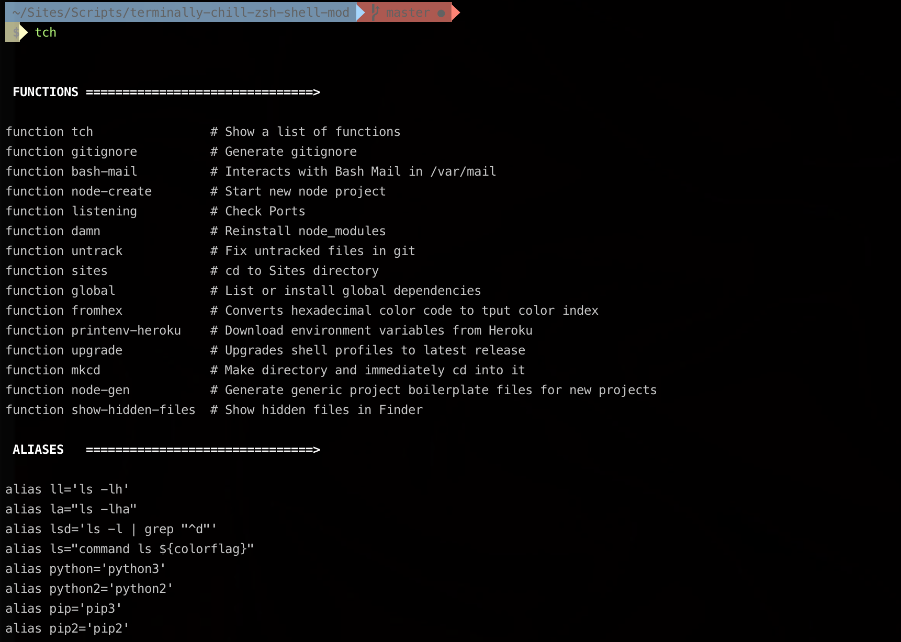

[![Contributors][contributors-shield]][contributors-url]
[![HitCount][hitcount-shield]][hitcount-url]
[![License: MIT][license-shield]][license-url]
[![LinkedIn][linkedin-shield]][linkedin-url]
[![ShellCheck][shellcheck-shield]][shellcheck-url]

<br />
<p align="center">
  <a href="https://github.com/HoukasaurusRex/terminally-chill-zsh-shell-mod">
    
  </a>

  <h1 align="center">Terminally Chill ZSH Config</h1>

  <p align="center">
    A fast, extensible terminal config for <a href="https://en.wikipedia.org/wiki/Z_shell">ZSH</a> — optimized for Node.js developers on macOS and Linux.
    <br />
    <br />
    <a href="https://github.com/HoukasaurusRex/terminally-chill-zsh-shell-mod/issues">Report Bug</a>
    &middot;
    <a href="https://github.com/HoukasaurusRex/terminally-chill-zsh-shell-mod/issues">Request Feature</a>
  </p>
</p>

## About

[![][product-screenshot]][product-url]

A curated ZSH configuration that gives you a productive shell out of the box. It includes lazy-loaded nvm, a beautiful prompt via Powerlevel10k, syntax highlighting, autosuggestions, and a handful of useful functions and aliases — all while keeping shell startup fast.

### Built With

* [ZSH](https://zsh.sourceforge.io/Doc/)
* [Oh My ZSH](https://ohmyz.sh/)
* [Powerlevel10k](https://github.com/romkatv/powerlevel10k)
* [zsh-syntax-highlighting](https://github.com/zsh-users/zsh-syntax-highlighting)
* [zsh-autosuggestions](https://github.com/zsh-users/zsh-autosuggestions)

## Getting Started

### Prerequisites

* A unix-based system (tested on macOS and Linux)
* [nvm](https://github.com/nvm-sh/nvm) (for Node.js version management)

### Installation

```sh
make install
```

This will:

1. Back up your existing dotfiles to `~/.backup_profiles/<timestamp>/`
2. Install [Homebrew](https://brew.sh/) if not already present
3. Install [Oh My ZSH](https://ohmyz.sh/), [Powerlevel10k](https://github.com/romkatv/powerlevel10k), [zsh-autosuggestions](https://github.com/zsh-users/zsh-autosuggestions), and [zsh-syntax-highlighting](https://github.com/zsh-users/zsh-syntax-highlighting)
4. Install [Crush](https://github.com/charmbracelet/crush) (AI coding assistant), Node LTS via nvm, and [Yarn](https://yarnpkg.com/) via corepack
5. Copy the config files from `lib/` to your home directory
6. Launch a new ZSH session

### Development Setup

To enable pre-commit hooks (shellcheck + startup time benchmark):

```sh
make setup
```

To run checks manually:

```sh
make test
```

### Reverting

To restore your previous shell config from the most recent backup:

```sh
make revert
```

## Usage

Run `tch` to see all available functions and aliases:



### Functions

| Command                | Description                                                      |
| ---------------------- | ---------------------------------------------------------------- |
| `tch`                  | List all custom functions and aliases                            |
| `listening [pattern]`  | Show listening TCP ports, optionally filtered                    |
| `damn [yarn\|npm]`     | Delete `node_modules` and reinstall                              |
| `mkcd <dir>`           | Create a directory and cd into it                                |
| `gitignore <lang>`     | Generate a `.gitignore` via [gitignore.io](https://gitignore.io) |
| `untrack`              | Remove cached files from git and recommit                        |
| `upgrade`              | Update Oh My ZSH to the latest version                           |
| `show-hidden-files`    | Toggle hidden files visible in macOS Finder                      |
| `fromhex <hex>`        | Convert a hex color to a tput color index                        |

### Aliases

| Alias    | Command               | Description                            |
| -------- | --------------------- | -------------------------------------- |
| `ll`     | `ls -lh`              | Long listing with human-readable sizes |
| `la`     | `ls -lha`             | Long listing including hidden files    |
| `lsd`    | `ls -l \| grep "^d"`  | List only directories                  |
| `python` | `python3`             | Default to Python 3                    |
| `pip`    | `pip3`                | Default to pip 3                       |

### Customization

Extend your shell by editing the corresponding files in [`lib/`](lib):

| File            | Purpose                                                  |
| --------------- | -------------------------------------------------------- |
| `.path`         | Extend `$PATH`                                           |
| `.exports`      | Environment variables and nvm lazy-loading               |
| `.aliases`      | Shell aliases                                            |
| `.functions`    | Shell functions (shown by `tch`)                         |
| `.extra`        | Color definitions and settings you don't want to commit  |
| `.bash_profile` | Personal variables (e.g., `GITHUB_USER`)                 |
| `.bash_prompt`  | Bash fallback prompt (ZSH uses Powerlevel10k)            |
| `.zshrc`        | Oh My ZSH config, plugins, and theme settings            |

### Performance

Shell startup is optimized with:

* **Powerlevel10k instant prompt** — the prompt renders immediately while the rest of ZSH loads in the background
* **Lazy-loaded nvm** — `nvm`, `node`, `npm`, and `npx` are wrapper functions that only source nvm on first use, saving ~200-800ms
* **Single compinit** — completion init runs once via Oh My ZSH with a cached zcompdump
* **Conditional iTerm2 integration** — escape sequences only run when inside iTerm2

### Oh My ZSH Plugins

The following plugins are enabled by default:

* `git` — Git aliases and completions
* `zsh-autosuggestions` — Fish-like command suggestions
* `node` — Node.js completions
* `sudo` — Press **Esc** twice to prepend `sudo`
* `docker` — Docker completions and aliases

## Roadmap

See the [open issues][issues-url] for proposed features and known issues.

## Contributing

Contributions are **greatly appreciated**. Check out the [issues page][issues-url].

1. Clone the repo
2. Create your feature branch (`git checkout -b release/my-feature`)
3. Commit your changes (`git commit -m 'add: my feature'`)
4. Push to the branch (`git push origin release/my-feature`)
5. Open a Pull Request

## License

Distributed under the MIT License. See [`LICENSE`](./LICENSE) for more information.

## Contact

JT Houk — [@HoukasaurusRex](https://twitter.com/HoukasaurusRex)

[contributors-shield]: https://img.shields.io/github/contributors/HoukasaurusRex/terminally-chill-zsh-shell-mod.svg?style=flat-square
[contributors-url]: https://github.com/HoukasaurusRex/terminally-chill-zsh-shell-mod/graphs/contributors
[hitcount-shield]: https://hits.dwyl.com/HoukasaurusRex/terminally-chill-zsh-shell-mod.svg
[hitcount-url]: https://hits.dwyl.com/HoukasaurusRex/terminally-chill-zsh-shell-mod
[linkedin-shield]: https://img.shields.io/badge/-LinkedIn-black.svg?style=flat-square&logo=linkedin&colorB=555
[linkedin-url]: https://www.linkedin.com/in/jt-houk/
[product-screenshot]: assets/screenshots/terminally-chill.png
[product-url]: #
[license-shield]: https://img.shields.io/badge/License-MIT-blue.svg?style=flat-square
[license-url]: ./LICENSE
[shellcheck-shield]: https://github.com/HoukasaurusRex/terminally-chill-zsh-shell-mod/actions/workflows/shellcheck.yml/badge.svg
[shellcheck-url]: https://github.com/HoukasaurusRex/terminally-chill-zsh-shell-mod/actions/workflows/shellcheck.yml
[issues-url]: https://github.com/HoukasaurusRex/terminally-chill-zsh-shell-mod/issues
